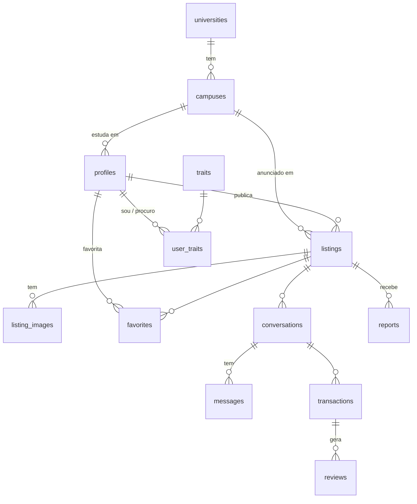

# Arquitetura

> Proposta para validação. Se o time preferir outra stack, é hora de falar: depois da Sprint 0 não dá mais para mudar.

## Stack

| Camada | Escolha | Por quê |
|---|---|---|
| Framework | **Next.js** (App Router) + **TypeScript** | Front e back no mesmo projeto, e o Claude Code conhece muito bem |
| Estilo | **Tailwind CSS** + **shadcn/ui** | Componentes prontos e acessíveis, customizados com os tokens do Figma |
| Formulários | react-hook-form + **zod** | Os mesmos schemas validam no cliente e no servidor |
| Backend | **Supabase** | Resolve de uma vez Postgres, Auth, Storage (fotos) e **Realtime (chat)**. Ninguém escreve backend "na mão" |
| Deploy | **Vercel** | Grátis, deploy automático da `main` e **preview por PR** (é por esse link que o Caike mostra as telas para a designer) |
| Design | **Figma + Figma MCP no Claude Code** | Ver [DESIGN.md](DESIGN.md) |

### Ambientes

| Ambiente | Supabase | Vercel | Uso |
|---|---|---|---|
| Dev | projeto `finds-dev` (compartilhado pelo time) | previews dos PRs + `localhost` | Desenvolvimento do dia a dia |
| Demo | projeto `finds-demo` | produção (branch `main`) | A mostra, com seed caprichado |

O plano gratuito do Supabase permite 2 projetos, exatamente o que precisamos.

## Princípios

1. **Server Components por padrão.** `'use client'` só onde há interação (formulários, chat, botões de favorito).
2. **Mutações via Server Actions**, sempre validadas com zod no servidor.
3. **Segurança no banco (RLS).** Toda tabela tem Row Level Security ativado. A chave `service_role` **nunca** vai para o cliente; ela só é usada no script de seed.
4. **O schema nasce completo na Sprint 0**, inclusive as tabelas do P1. Assim evitamos 4 pessoas criando migrations concorrentes.
5. **Idioma:** interface, rotas (URLs) e docs em **português**; código (variáveis, componentes, tabelas, colunas) em **inglês**.

## Estrutura de pastas

```
finds/
├── CLAUDE.md
├── .mcp.json                     # Figma MCP (compartilhado)
├── docs/
├── supabase/
│   ├── migrations/               # SQL versionado — dono: Josué
│   └── seed/                     # dados e fotos do seed — dono: Alexandre
├── scripts/
│   └── seed.ts                   # popula o banco via service_role — dono: Alexandre
└── src/
    ├── app/
    │   ├── (auth)/               # layout: Caike · páginas: Kaike
    │   │   ├── entrar/
    │   │   ├── cadastro/
    │   │   ├── verificar-email/
    │   │   └── completar-perfil/
    │   ├── (main)/               # layout com navbar: Caike
    │   │   ├── page.tsx          # feed/home — Kaike
    │   │   ├── busca/            # Kaike
    │   │   ├── anuncios/[id]/    # detalhe — Kaike
    │   │   ├── anuncios/[id]/editar/   # Josué
    │   │   ├── anunciar/         # escolher tipo + formulário — Josué
    │   │   ├── meus-anuncios/    # Josué
    │   │   ├── favoritos/        # Alexandre
    │   │   ├── mensagens/        # chat — Alexandre
    │   │   ├── negociacoes/      # transações — Alexandre
    │   │   ├── roommates/        # match — Kaike
    │   │   ├── perfil/[username]/      # perfil público — Kaike
    │   │   └── configuracoes/    # editar perfil + perfil de convivência — Kaike
    │   └── (marketing)/          # landing page para deslogados — Caike
    ├── components/               # VISUAL — Caike cria os de destaque; os outros usam
    │   ├── ui/                   # shadcn customizado com o tema — Caike
    │   ├── layout/               # navbar, footer, containers — Caike
    │   ├── auth/  profile/  match/  listings/  discovery/  chat/  transactions/
    │   └── listings/form/        # campos dos formulários de anúncio — Josué (com ui/)
    ├── lib/
    │   ├── supabase/             # client.ts, server.ts, middleware.ts — Josué
    │   ├── validations/          # schemas zod por domínio (cada dono cuida do seu)
    │   ├── match.ts              # algoritmo de compatibilidade — Kaike
    │   └── utils.ts
    └── types/
        └── database.ts           # GERADO por `supabase gen types` — Josué, não editar
```

**Regra de ouro:** cada pasta tem um dono. Se precisar mexer na pasta de outra pessoa, avise no grupo ou peça no PR. Pastas compartilhadas (`components/ui`, `lib/supabase`, `migrations`) só mudam com aviso.

**Visual × lógica:** o Caike é dono do visual de todas as telas e pode ajustar JSX e estilo em qualquer página; a lógica (dados, actions, validações) é do dono da rota. Detalhes em [DESIGN.md](DESIGN.md#divisão-visual--lógica).

## Modelo de dados



### Tabelas

**`universities`**: `id`, `name`, `email_domain` (ex.: `ufu.br`)

**`campuses`**: `id`, `university_id`, `name`, `city`
Seed da UFU: Santa Mônica, Umuarama, Educação Física e Glória (Uberlândia); Pontal (Ituiutaba); Monte Carmelo; Patos de Minas. *Confirmar a lista.*
A cidade vem do campus, então não guardamos cidade solta.

**`profiles`** (1:1 com `auth.users`, criada por trigger no cadastro)
`id` (= auth user id), `username` (único), `full_name`, `avatar_url`, `bio`, `university_id`, `campus_id` (nulo até completar o perfil), `last_seen_at`, `created_at`
Perfil completo = `campus_id IS NOT NULL`.

**`listings`**
`id`, `owner_id`, `type` (`product` | `service` | `roommate` | `republic`), `status` (`draft` | `active` | `paused` | `closed`), `title`, `description`, `price` (numeric, nulo = "a combinar"), `campus_id`, `details` (jsonb, específico por tipo), `created_at`, `updated_at`

`details` por tipo, validado por schemas zod em `src/lib/validations/listings.ts`:

| Tipo | Campos em `details` |
|---|---|
| `product` | `category` (livros, eletrônicos, móveis, eletrodomésticos, roupas, material de estudo, outros), `condition` (novo, seminovo, usado) |
| `service` | `category` (aulas, design, programação, fotografia, reparos, beleza, outros), `modality` (presencial, online, flexível), `price_unit` (hora, projeto, a combinar) |
| `roommate` | `mode` (oferece_vaga, procura_vaga), `housing_type` (apartamento, casa), `neighborhood`, `move_in_date`, `gender_preference` (qualquer, feminino, masculino) |
| `republic` | `vacancies`, `gender` (feminina, masculina, mista), `neighborhood`, `amenities[]` (wifi, mobiliada, garagem, lavanderia, contas inclusas…) |

> As categorias e opções devem seguir o que está no Figma. A tabela acima é um ponto de partida.

**`listing_images`**: `id`, `listing_id`, `path` (Storage), `position`

**`favorites`**: `user_id`, `listing_id`, `created_at` (PK composta)

**`conversations`**: `id`, `listing_id`, `buyer_id` (interessado), `seller_id` (dono do anúncio), `last_message_at`, `created_at`, com `UNIQUE(listing_id, buyer_id)`

**`messages`**: `id`, `conversation_id`, `sender_id`, `content`, `read_at`, `created_at`

**`transactions`**
`id`, `listing_id`, `conversation_id`, `seller_id`, `buyer_id`, `status` (`pending` | `confirmed` | `completed` | `cancelled`), `created_by`, `seller_completed_at`, `buyer_completed_at`, `cancelled_by`, `cancel_reason`, `created_at`

**`reviews`**: `id`, `transaction_id`, `reviewer_id`, `reviewed_id`, `rating` (1–5), `comment`, `created_at`, com `UNIQUE(transaction_id, reviewer_id)`

**`reports`**: `id`, `listing_id`, `reporter_id`, `reason` (golpe, conteúdo impróprio, anúncio falso, spam, outro), `description`, `created_at`

**`traits`**: `id`, `key`, `label`, `group` (rotina, organização, convivência, estilo de vida, hábitos)

**`user_traits`**: `user_id`, `trait_id`, `kind` (`self` = "eu sou" | `wanted` = "procuro"), PK composta

### Storage (buckets)

- `listing-images`: leitura pública, escrita só na pasta `{user_id}/`
- `avatars`: leitura pública, escrita só no próprio arquivo

### RLS (resumo)

| Tabela | Leitura | Escrita |
|---|---|---|
| `profiles` | usuários logados | só o próprio |
| `listings` | `active` para logados; `draft`/`paused` só o dono | só o dono |
| `favorites` | só o próprio | só o próprio |
| `conversations`, `messages` | só os 2 participantes | só os participantes |
| `transactions` | só as 2 partes | só as partes, respeitando as transições de status |
| `reviews` | usuários logados | só quem participou de transação `completed` |
| `reports` | ninguém (só admin via dashboard) | qualquer logado |
| `traits` | todos | ninguém (seed) |
| `user_traits` | usuários logados | só o próprio |
| `campuses`   | Publico (autenticados) | Nenhuma (via app)              |
| `universities` | Publico (autenticados) | Nenhuma (via app)              |

## Fluxos principais

### Cadastro e onboarding
1. `/cadastro`: nome, username, e-mail, senha. O zod valida se o domínio do e-mail está em `universities.email_domain`, e o servidor valida de novo.
2. O Supabase envia a confirmação de e-mail, e um trigger cria a linha em `profiles`.
3. A pessoa já navega no feed e nos anúncios.
4. Ao tentar **anunciar, conversar, favoritar ou negociar**, o helper `requireCompleteProfile()` (servidor) ou o modal "Complete seu perfil" (cliente) leva para `/completar-perfil?next=...`, onde ela escolhe o campus.

### Chat
- O botão "Tenho interesse" no detalhe do anúncio cria ou reabre a conversa (`UNIQUE(listing_id, buyer_id)`).
- `/mensagens` tem 2 painéis: conversas à esquerda, mensagens à direita.
- Tempo real: **Supabase Realtime** (`postgres_changes` em `messages`, filtrado por `conversation_id`).

### Transação (confirmação dupla)
```
qualquer parte propõe ──► pending ──(outra parte aceita)──► confirmed ──(as DUAS marcam "concluído")──► completed ──► avaliações liberadas
                             │                                  │
                             └──────── cancelled (motivo obrigatório) ◄────┘
```
Quando um produto tem transação concluída, o anúncio vai para `closed` ("vendido").

### Match de roommates (versão P0)
- ~20 tags fixas na tabela `traits`, agrupadas (ex.: *dorme cedo*, *noturno*, *organizado*, *gosta de silêncio*, *recebe visitas*, *tem pet*, *não fuma*…).
- Em `/configuracoes/convivencia`, a pessoa marca as tags **"eu sou"** e **"procuro"**.
- O score entre o usuário A (quem busca) e o dono B de um anúncio de roommate ou república:

```
aderência(A→B) = |procuro(A) ∩ sou(B)| / |procuro(A)|
aderência(B→A) = |procuro(B) ∩ sou(A)| / |procuro(B)|
score = média das aderências que existirem (se um lado não marcou "procuro", usa só o outro)
```

- `/roommates` lista os anúncios ordenados pelo score, mostrando o **"87% compatível"** e as tags em comum destacadas.
- É calculado em TypeScript no servidor (`src/lib/match.ts`). No volume da demo não precisa de SQL.

### Último acesso
O layout `(main)` atualiza `profiles.last_seen_at` no máximo a cada 5 minutos. O perfil e o card do anunciante mostram "ativo há X".

## Variáveis de ambiente

```
NEXT_PUBLIC_SUPABASE_URL=
NEXT_PUBLIC_SUPABASE_ANON_KEY=        # chave pública (anon/publishable)
SUPABASE_SERVICE_ROLE_KEY=            # SÓ para scripts/seed.ts — nunca no cliente, nunca no git
SUPABASE_SEED_TARGET=                 # só para rodar o seed: precisa ser "finds-dev" (confirmação manual, o seed apaga e recria dados)
```

`.env.local` fica fora do git. Os valores são compartilhados no grupo privado. O `scripts/seed.ts` só lê `.env.local` (via `process.loadEnvFile`), não `.env` — rode com `npm run seed`.
